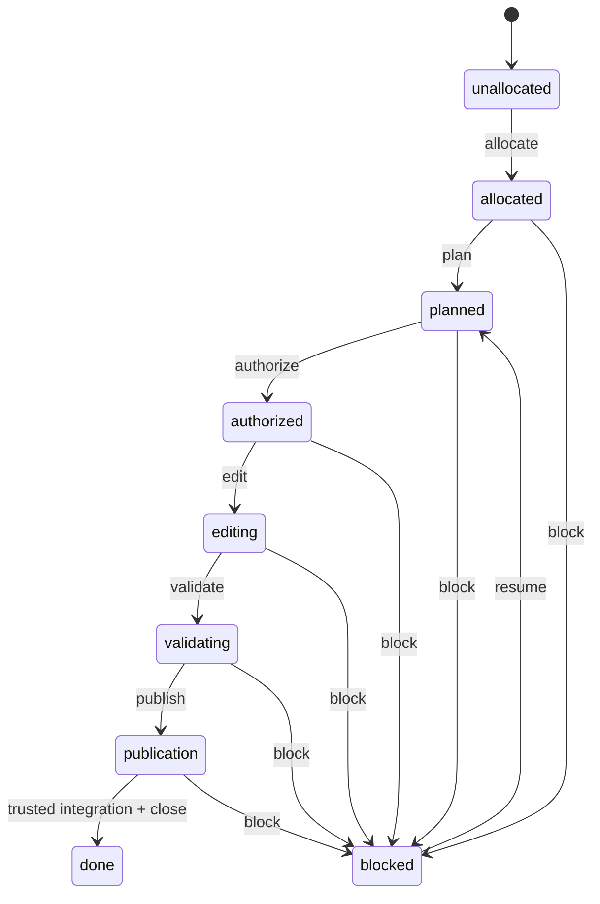

# Ticket lifecycle

```dsl
DOCUMENT TICKET_LIFECYCLE
VERSION 1
LANGUAGE EN
MODE STRICT
SCHEMA "wellmanifest.ticket-lifecycle/v1"
REQUEST_GRAMMAR "ticket-lifecycle.v1.gbnf"
POLICY "../.governance/manifest.json"
```

## Responsibility

This module owns the lifecycle of one bounded unit of repository work. A ticket
records the requested outcome, non-goals, exact write scope, architecture,
budgets, authorization class, evidence and workflow state. It does not grant
Git transport access, identify a human by inference, contain executable source,
or turn model prose into trusted approval.

It composes with the separately versioned `git-lifecycle` standard through
opaque receipt and evidence references. The adopted
`.governance/manifest.json` and `AGENTS.md` govern this repository. A content
change increments this document's declared version; incompatible request
semantics use a new schema family rather than silently changing `/v1`.

## State machine



```dsl
STATE unallocated
STATE allocated
STATE planned
STATE authorized
STATE editing
STATE validating
STATE publication
STATE done
STATE blocked

TRANSITION unallocated -> allocated ACTION allocate
TRANSITION allocated -> planned ACTION plan
TRANSITION planned -> authorized ACTION authorize
TRANSITION authorized -> editing ACTION edit
TRANSITION editing -> validating ACTION validate
TRANSITION validating -> publication ACTION publish
TRANSITION publication -> done ACTION close
TRANSITION ACTIVE_NONTERMINAL -> blocked ACTION block
TRANSITION blocked -> planned ACTION resume
```

The lifecycle state is separate from the ticket's public status fields. The
controller projects it as follows:

| Lifecycle | Ticket status | Workflow state |
| --- | --- | --- |
| allocated, planned | BACKLOG or IN_PROGRESS | ANALYSIS or PLAN |
| authorized, editing | IN_PROGRESS | TOOLS, DELEGATION or EDIT |
| validating | IN_PROGRESS | VALIDATION |
| publication | IN_PROGRESS | PUBLICATION |
| blocked | BLOCKED | BLOCKED |
| done | DONE | DONE |

## Allocation and ownership

Ticket IDs are allocated only by the managed clone-wide allocator after
fetch/prune. The lock and high-water reservation include all linked worktrees
and known local/remote refs. A model never chooses a numeric ID or creates the
directory itself.

One implementation diff resolves to exactly one active ticket. Parallel work
uses distinct manifest workstreams, non-overlapping allowed paths and separate
worktrees. When two worktrees of the same repository are `IN_PROGRESS` at
once, each intent must either keep disjoint `allowedPaths` or list the other
ticket in `conflictsWith`. The adopted `worktree-guard.yaml` checker from
`wellmanifest/new-project` fail-closes undeclared overlap before `edit` /
`validate`. A waiting or blocked ticket releases its write reservation so it
cannot deadlock unrelated progress. A matching active ticket is reused rather
than replaced. See [WORKTREE_GUARD.md](WORKTREE_GUARD.md).

## Plan and bounded intent

Before implementation, the controller records:

- outcome and explicit non-goals;
- `allowedPaths` and forbidden human-participant paths;
- workstream, dependencies, conflicts and optional integration ticket;
- real `acceptedBaseSha`, target branch, file/component/interface/dependency
  budgets and accepted architecture;
- validation commands bound to acceptance criteria and evidence references.

No placeholder SHA is valid. For a new repository, `git-lifecycle` first
creates the narrow governance-only seed baseline, then the resulting real SHA
becomes `acceptedBaseSha` before the `edit` transition.

## Authorization classes

```dsl
SESSION_EXECUTION_AUTHORIZATION =
  USER_REQUEST_AUTHORIZES_EXECUTION_OR_AUTONOMOUS_MODE
  AND REQUESTED_OUTCOME_MATCHES_BOUNDED_INTENT

SEPARATE_AUTHORITY_REQUIRED =
  DESTRUCTIVE_ACTION
  OR SECRET_ACCESS
  OR NEW_EXTERNAL_COORDINATION
  OR MATERIAL_OBJECTIVE_EXPANSION
  OR TRUSTED_MERGE
  OR RELEASE_PUBLICATION
```

Session authorization prevents redundant prompts inside a stable, recorded
scope. It is not a trusted review, merge or release authorization. The one
autonomous seed commit is governed by `git-lifecycle`; ordinary commits remain
subject to the publication rules.

## Validation, publication and closure

The required governance gate runs before stack tests. Validation binds the
current diff to intent scope, workstream ownership, accepted base, architecture
and budgets. LLM findings remain advisory; required verdicts are deterministic
and expose stable diagnostic codes.

An implementation ticket remains `IN_PROGRESS / PUBLICATION` while its PR is
open. Exact-head trusted review and required checks precede merge. `DONE / DONE`
is written only by a governance-only closure from the integrated default
branch, with merge SHA and post-merge evidence. Closing an unmerged full-diff
branch is forbidden.

## Request and receipt boundary

[`ticket-lifecycle.schema.json`](../standard/ticket-lifecycle.schema.json) defines request,
state and receipt variants. The GBNF emits only canonical transition requests.
It uses opaque `artifact:`, `authorization:`, `decision:` and `receipt:`
references; referenced content is resolved and revalidated by the controller.

A request cannot contain user prose, source paths, shell text, secrets, review
bodies, provider payloads or arbitrary URLs. For `allocate`, the ticket is null
because the managed allocator returns it. Every later request binds the exact
ticket and intent reference.

## Invariants and failure behavior

- `(repositoryRef, idempotencyKey)` is unique; replay with changed content is
  rejected.
- `edit` requires a real accepted base and session authorization.
- `publish` cannot create trusted approval; it stops at a reviewable PR.
- `close` requires resolved trusted integration and post-merge evidence.
- `block` preserves evidence and releases workstream/write reservations.
- `resume` revalidates base, scope, dependencies and foreign workspace state.
- Unknown references, state mismatch, scope overlap or missing evidence reject
  before repository mutation and yield a redacted receipt.
