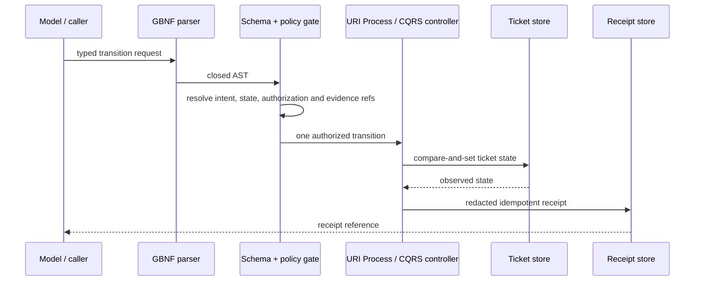

# Ticket lifecycle logic flow

Allocation is performed by the managed clone-wide allocator; a request cannot
choose the ticket number. Planning binds a real Git baseline, scope, budgets and
validation evidence. Session authorization permits work only inside that
intent. Publication stops at a reviewable PR, while `done` requires separately
resolved trusted merge and post-merge evidence.

`block` releases the workstream and write reservation while preserving context.
`resume` revalidates the base, dependencies, scope and workspace before editing.
State mismatch, missing evidence, overlap, an unknown reference or fields
outside the schema reject before repository mutation.
